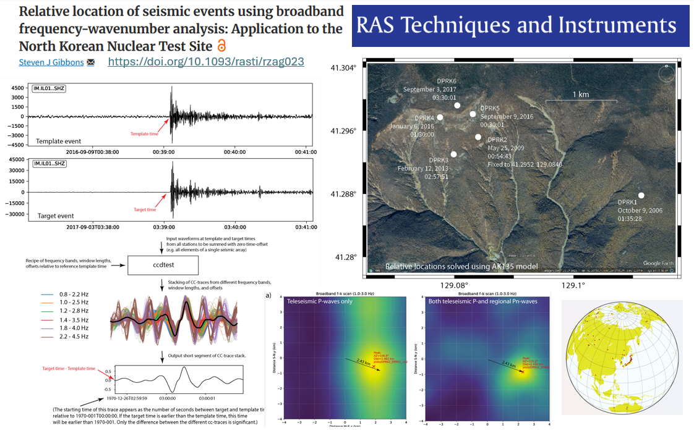

# XY2LATLON  
A simple python program (*xy2latlon.py*) to convert locations in Cartesian coordinates to latitude and longitude given a reference location  

Release v1.0.0 is permanently stored on Zenodo with DOI 10.5281/zenodo.18213889  

  

https://sqaaas.eosc-synergy.eu/full-assessment/report/https://raw.githubusercontent.com/eosc-synergy/XY2LATLON.assess.sqaaas/main/.report/assessment_output.json

An example is given where the script is executed using the shell script *run_xy2latlon.sh*.  

If you publish using this code, I kindly ask you to cite the following paper: 
**Relative location of seismic events using broadband frequency-wavenumber analysis: Application to the North Korean Nuclear Test Site**  
Steven J. Gibbons, *RAS Techniques and Instruments*, rzag023, https://doi.org/10.1093/rasti/rzag023

